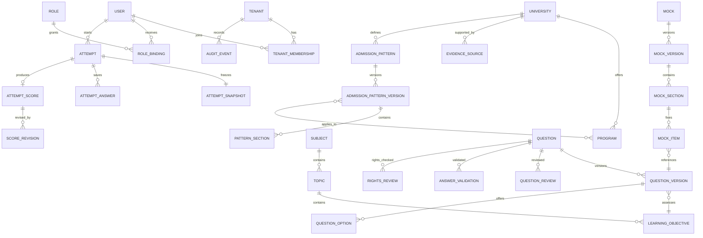

# Core entity relationship model

All tenant-owned aggregates carry `tenant_id`. Tenant context is derived from authenticated membership, not client input. Stable roots (`Question`, `Mock`, `AdmissionPattern`) identify concepts; immutable versions reproduce what was published or presented.
