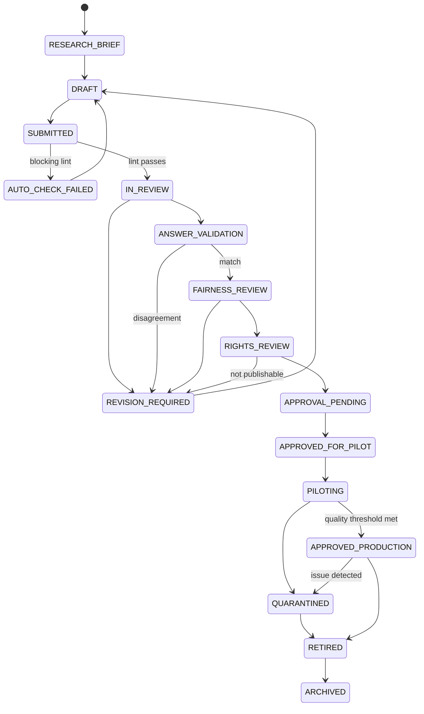

# Question governance and state machine

Transitions are explicit commands with actor, tenant, reason, source version, target version, and audit event. Setters cannot approve their work. Quantitative validation is blind-first where practical. Only internal-original, licensed, verified-open-license, or verified-public-domain rights may reach production. Semantic similarity flags review; it does not automatically reject. Published versions are never edited in place.

Automated lint covers required metadata, valid/unique options, key cardinality, scores, solution/objective, media and math rendering, rights/provenance, duplicates, and unresolved comments. `QuestionLintResult` is extensible and separates blocking errors from warnings.
