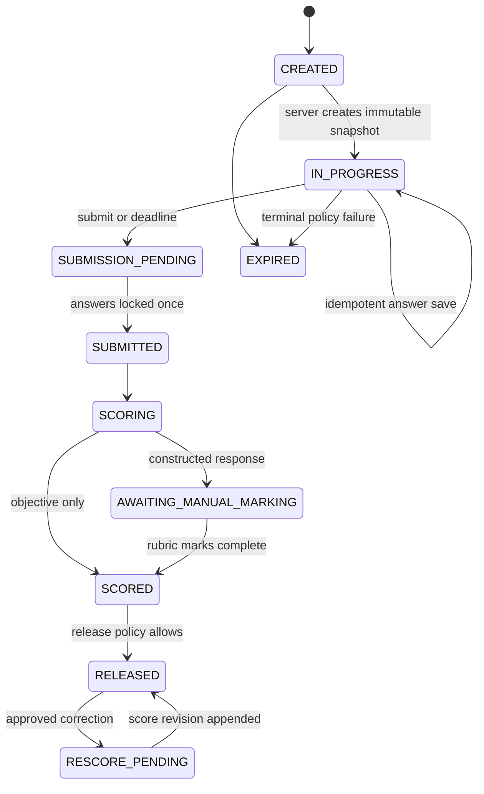

# Attempt and scoring lifecycle

The snapshot fixes mock, pattern and scoring-policy versions; question version IDs; question and option order; server start/deadline; and review policy. Server time is authoritative. Correct answers and hidden explanations are excluded from active-exam DTOs.

Scoring is deterministic and decimal-safe. Policy configuration supports correct/wrong/skip values, section weights and pass rules, rounding, future partial credit, essay rubric, and practice benchmark. Original `AttemptScore` is immutable; a controlled rescore appends `ScoreRevision` and `ScoreEvent` with old/new values, reason, approver, and affected item versions.
