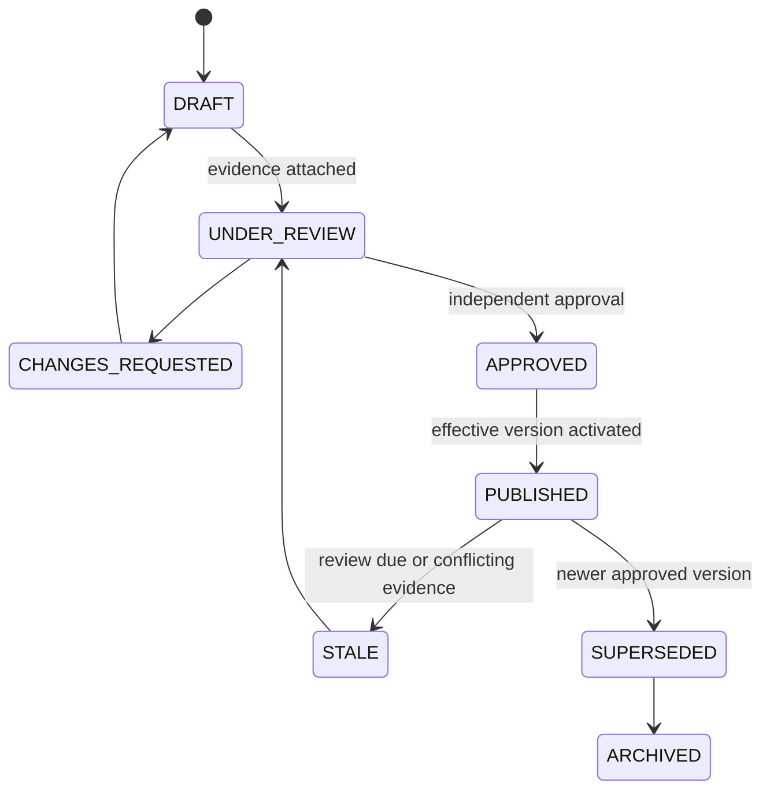

# University evidence and pattern policy

Evidence tiers: A—current official page/PDF/circular; B—older official sample linked by a current official page; C—retained written admissions-office clarification; D—research lead only. Tier D never changes production configuration automatically.

Each claim records university/program group/intake, claim and evidence types, source reference and preserved snapshot/hash, observed/effective dates, researcher, verifier, confidence, status, next review, and notes. Legal permissions govern retention and display of source material.

## Pattern lifecycle

Publishing requires approved evidence and configured applicability, sections, timing, scoring reference, effective range, and no overlap conflicting with another active version. No university facts are coded into application constants or authoritative seeds.
